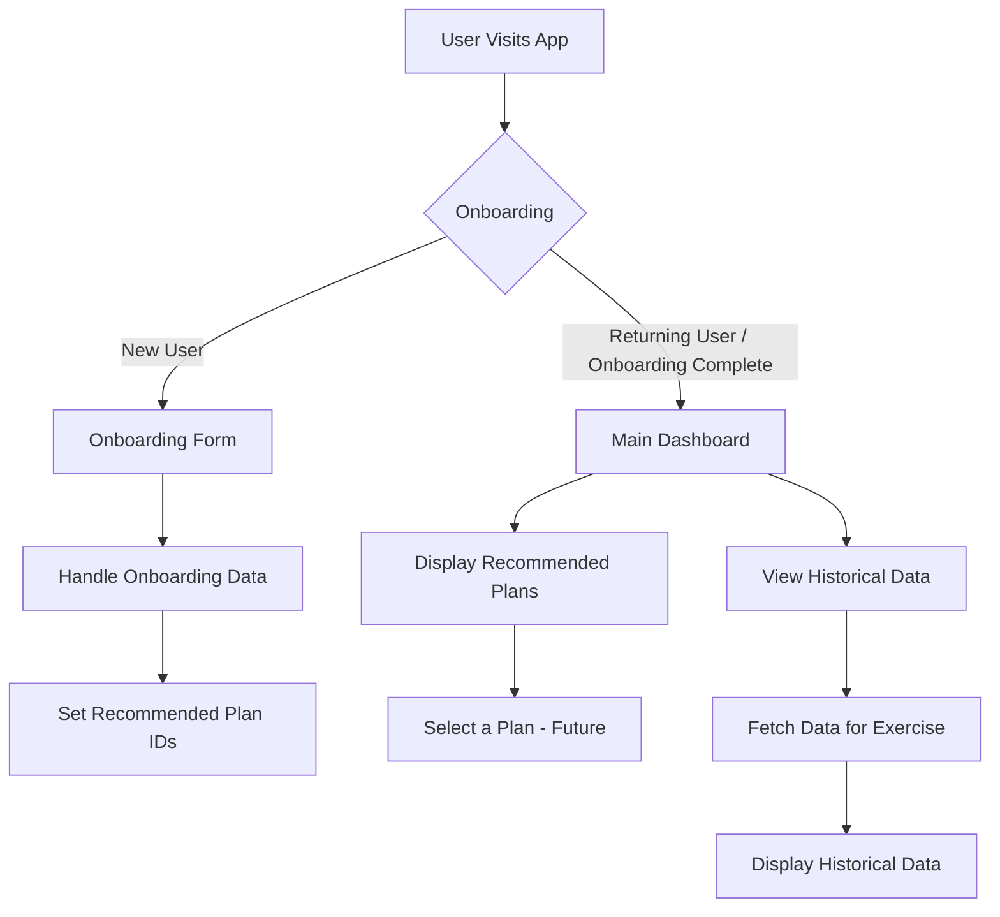

# LiftAssist - Your AI-Powered Fitness Companion

LiftAssist is a Next.js application designed to help users manage their fitness journey, get personalized training plans, and track their progress. It leverages AI to provide tailored recommendations and insights.

## Table of Contents

- [Features](#features)
- [Getting Started](#getting-started)
  - [Prerequisites](#prerequisites)
  - [Installation](#installation)
  - [Running the Development Server](#running-the-development-server)
- [Project Structure](#project-structure)
- [Key Technologies](#key-technologies)
- [Available Scripts](#available-scripts)
- [Dependency Management](#dependency-management)
- [Contributing](#contributing)
- [License](#license)

## Features

- **User Onboarding**: Collects user fitness goals and focus areas to personalize experience.
- **Recommended Training Plans**: Suggests training plans based on user input.
- **Training Plan Display**: Shows details of recommended training plans.
- **Historical Workout Data**: Allows users to view their past workout performance for specific exercises (integration in progress).
- **Diagrams with MermaidJS**: Utilizes MermaidJS to render diagrams within the application.

### Example Diagram (Illustrating App Flow)



## Getting Started

### Prerequisites

- Node.js (v18.x or later recommended)
- npm (or yarn/pnpm)

### Installation

1.  **Clone the repository (if applicable)**:
    ```bash
    git clone <repository-url>
    cd <repository-directory>
    ```

2.  **Install dependencies**:
    ```bash
    npm install
    ```

### Environment Configuration

This project requires a Google Generative AI API key to function.

1.  **Create a `.env` file**: In the root of the project, create a file named `.env`.
2.  **Use the example file**: Copy the contents of `.env.example` into your new `.env` file.
    ```bash
    cp .env.example .env
    ```
3.  **Add your API Key**: Open the `.env` file and replace `YOUR_API_KEY_HERE` with your actual Google Generative AI API key. You can obtain an API key from the Google AI Studio website.
4.  **IMPORTANT SECURITY NOTICE**:
    *   The `.env` file contains sensitive credentials. **DO NOT commit this file to Git.**
    *   Keep your API key secret and do not share it publicly.
    *   The project's `.gitignore` file is already configured to ignore the `.env` file, helping to prevent accidental commits.

### Running the Development Server

To start the development server:

```bash
npm run dev
```

Open [http://localhost:3000](http://localhost:3000) with your browser to see the result.

## Project Structure

A brief overview of the key directories:

```
.
├── .github/                # GitHub specific files (e.g., Dependabot)
├── public/                 # Static assets
├── src/
│   ├── ai/                 # AI-related flows and logic
│   ├── app/                # Next.js App Router pages and layouts
│   ├── components/         # React components
│   │   ├── history/        # Components for displaying historical data
│   │   ├── onboarding/     # Components related to user onboarding
│   │   ├── training/       # Components for training plans
│   │   └── ui/             # General UI components (e.g., Button, Card, MermaidDiagram)
│   ├── data/               # Static data files (e.g., trainingPlans, alternativeExercises)
│   ├── hooks/              # Custom React hooks
│   ├── lib/                # Utility functions
│   └── ...                 # Other TypeScript files
├── next.config.ts          # Next.js configuration
├── package.json            # Project dependencies and scripts
├── README.md               # This file
└── tsconfig.json           # TypeScript configuration
```

## Key Technologies

- [Next.js](https://nextjs.org/) - React framework for building user interfaces.
- [TypeScript](https://www.typescriptlang.org/) - Typed JavaScript for better code quality and maintainability.
- [Tailwind CSS](https://tailwindcss.com/) - Utility-first CSS framework (assumed from `globals.css`).
- [shadcn/ui](https://ui.shadcn.com/) - Re-usable UI components (inferred from component structure like `components/ui/button.tsx`).
- [React Hook Form](https://react-hook-form.com/) & [Zod](https://zod.dev/) - For form validation.
- [Mermaid](https://mermaid.js.org/) - For generating diagrams from text.
- [ESLint](https://eslint.org/) & [Prettier](https://prettier.io/) - For code linting and formatting (assumed standard setup).

## Available Scripts

In the `package.json`, you will find scripts such as:

- `npm run dev`: Starts the development server.
- `npm run build`: Builds the application for production.
- `npm run start`: Starts a production server.
- `npm run lint`: Lints the codebase using ESLint.
- `npm run typecheck`: Runs TypeScript to check for type errors.

## Dependency Management

This project uses `npm` for package management. Dependencies are defined in `package.json`.

- **Dependabot**: Configured via `.github/dependabot.yml` to automatically create pull requests for version updates of npm packages, checking daily.

## Contributing

Contributions are welcome! Please follow these steps:

1.  Fork the repository.
2.  Create a new branch (`git checkout -b feature/your-feature-name`).
3.  Make your changes.
4.  Commit your changes (`git commit -m 'Add some feature'`).
5.  Push to the branch (`git push origin feature/your-feature-name`).
6.  Open a Pull Request.

Please ensure your code adheres to the project's linting and formatting standards.

## License

This project is licensed under the MIT License. See the `LICENSE` file for details (assuming MIT, common for starters - if a `LICENSE` file exists, otherwise this can be updated).
