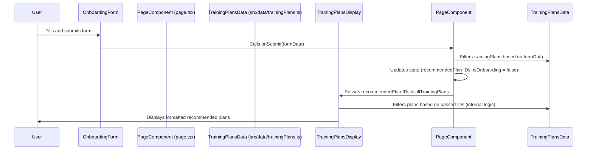
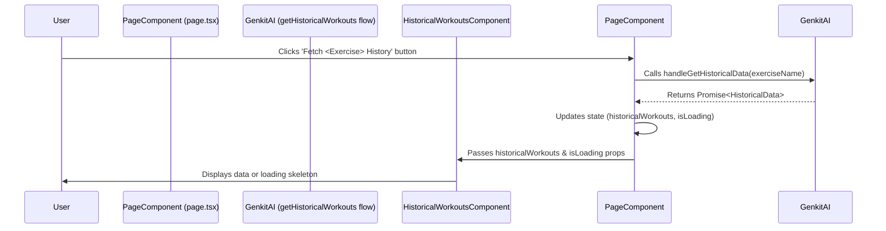

# LiftAssist - Technical Overview

This document provides a technical overview of the LiftAssist application, including its architecture, key components, data flows, and development practices.

## Table of Contents

- [1. Introduction](#1-introduction)
- [2. Architecture](#2-architecture)
  - [2.1. Frontend](#21-frontend)
  - [2.2. Backend (AI Flows)](#22-backend-ai-flows)
  - [2.3. Data Management](#23-data-management)
- [3. Key Components and Their Responsibilities](#3-key-components-and-their-responsibilities)
  - [3.1. `src/app/page.tsx`](#31-srcapppagetsx)
  - [3.2. `src/components/onboarding/OnboardingForm.tsx`](#32-srccomponentsonboardingonboardingformtsx)
  - [3.3. `src/components/training/TrainingPlansDisplay.tsx`](#33-srccomponentstrainingtrainingplansdisplaytsx)
  - [3.4. `src/components/history/HistoricalWorkouts.tsx`](#34-srccomponentshistoryhistoricalworkoutstsx)
  - [3.5. `src/components/ui/MermaidDiagram.tsx`](#35-srccomponentsuimermaiddiagramtsx)
  - [3.6. `src/data/`](#36-srcdata)
  - [3.7. `src/ai/flows/`](#37-srcaiflows)
- [4. Data Flows](#4-data-flows)
  - [4.1. Onboarding to Plan Recommendation](#41-onboarding-to-plan-recommendation)
  - [4.2. Fetching Historical Data](#42-fetching-historical-data)
- [5. State Management](#5-state-management)
- [6. Styling](#6-styling)
- [7. Tooling and Development Practices](#7-tooling-and-development-practices)
  - [7.1. TypeScript](#71-typescript)
  - [7.2. Linting and Formatting](#72-linting-and-formatting)
  - [7.3. Dependency Management](#73-dependency-management)
  - [7.4. Version Control](#74-version-control)
- [8. Future Considerations](#8-future-considerations)

## 1. Introduction

LiftAssist is a Next.js web application aimed at providing users with AI-driven fitness guidance, including personalized training plans and workout tracking. This document outlines the technical aspects of the project.

## 2. Architecture

### 2.1. Frontend

- **Framework**: Next.js (App Router)
- **Language**: TypeScript
- **UI Components**: Primarily custom components, with shadcn/ui for base elements like buttons, cards, etc.
- **Styling**: Tailwind CSS (assumed from `globals.css` and typical Next.js setups).

### 2.2. Backend (AI Flows)

- **AI Logic**: Encapsulated in Genkit flows (e.g., `getHistoricalWorkouts` located in `src/ai/flows/`). These are server-side functions that can be called from the frontend.
- **Communication**: Frontend interacts with AI flows via server actions or API routes (details depend on Genkit integration specifics, currently abstracted by function calls like `getHistoricalWorkouts`).

### 2.3. Data Management

- **Static Data**: Configuration data like predefined training plans and alternative exercises are stored in `src/data/`.
- **Application State**: Managed within React components using `useState` and `useEffect`. No global state management library (like Redux or Zustand) is currently in use, but could be added if complexity grows.
- **User Data**: Specifics of user data persistence (e.g., workout logs, user profiles) are yet to be fully implemented but would likely involve a database.

## 3. Key Components and Their Responsibilities

### 3.1. `src/app/page.tsx`

- **Role**: Main page component, acts as the primary orchestrator for user interactions on the home page.
- **Responsibilities**:
    - Manages core application state (e.g., onboarding status, recommended plans, historical workout data).
    - Handles data fetching calls to AI flows.
    - Renders conditional UI based on application state (e.g., showing `OnboardingForm` vs. main content).
    - Passes data and callbacks down to child components.

### 3.2. `src/components/onboarding/OnboardingForm.tsx`

- **Role**: UI and logic for collecting user's initial fitness goals and preferences.
- **Responsibilities**:
    - Renders the onboarding form using `shadcn/ui` components (`Card`, `Form`, `Select`, `Button`).
    - Uses `react-hook-form` for form handling and `zod` for schema validation.
    - Calls an `onSubmit` prop passed from `page.tsx` with the validated form data.

### 3.3. `src/components/training/TrainingPlansDisplay.tsx`

- **Role**: Displays details of recommended training plans.
- **Responsibilities**:
    - Receives a list of all available training plans and a string of recommended plan IDs.
    - Filters and displays the relevant plans.
    - Uses `Card` components to present plan information.

### 3.4. `src/components/history/HistoricalWorkouts.tsx`

- **Role**: Displays historical workout data for a specific exercise.
- **Responsibilities**:
    - Receives workout data and a loading state as props.
    *   Renders a table with historical data (sets, reps, weight, date).
    *   Shows loading skeletons while data is being fetched.
    *   Displays a message if no data is available.

### 3.5. `src/components/ui/MermaidDiagram.tsx`

- **Role**: A general-purpose component to render diagrams using MermaidJS.
- **Responsibilities**:
    - Takes a Mermaid chart definition string as a prop.
    - Initializes Mermaid and renders the SVG diagram into a designated `div`.
    - Handles asynchronous rendering and potential errors from the Mermaid library.

### 3.6. `src/data/`

- **Role**: Stores static, predefined data for the application.
- **Examples**:
    - `trainingPlans.ts`: Contains an array of predefined workout plans.
    - `alternativeExercises.ts`: Contains a mapping of exercises to their alternatives.

### 3.7. `src/ai/flows/`

- **Role**: Contains Genkit AI flow definitions.
- **Examples**:
    - `get-historical-workouts.ts`: Defines the flow to fetch historical workout data (currently mock data).

## 4. Data Flows

### 4.1. Onboarding to Plan Recommendation



### 4.2. Fetching Historical Data



## 5. State Management

- **Local Component State**: `useState` is used for managing component-level state (e.g., loading flags, form inputs, UI toggles).
- **Page-Level State**: The main `page.tsx` component holds and manages state that needs to be shared between its child components (e.g., `isOnboarding`, `recommendedPlan`, `historicalWorkouts`). This state is passed down via props.
- **Derived State**: Some data is derived from existing state or props directly within components. `useMemo` was considered but is not currently used after recent refactorings.
- **Client-Side Hydration Check**: A `isClient` state variable, set in a `useEffect`, is used to manage logic that should only run on the client-side, avoiding hydration mismatches.

## 6. Styling

- **Tailwind CSS**: Utilized for styling, as indicated by `globals.css` and common Next.js practice.
- **`shadcn/ui`**: Provides unstyled base components that are then styled using Tailwind, ensuring consistency and customizability. Located in `src/components/ui/`.

## 7. Tooling and Development Practices

### 7.1. TypeScript

The project is written in TypeScript, providing static typing for improved code quality, refactoring safety, and developer experience.

### 7.2. Linting and Formatting

- **ESLint**: Used for identifying and reporting on patterns in JavaScript/TypeScript. Configured in Next.js by default.
- **Prettier**: (Assumed) For automatic code formatting to maintain a consistent style.

### 7.3. Dependency Management

- **npm**: Used as the package manager.
- **Dependabot**: Configured in `.github/dependabot.yml` to keep dependencies up-to-date by automatically creating pull requests for updates to npm packages.

### 7.4. Version Control

- **Git**: Used for version control.
- **GitHub**: (Assumed) The repository is hosted on GitHub.

## 8. Future Considerations

- **Global State Management**: If application complexity grows, a dedicated state management library (e.g., Zustand, Jotai, or Redux Toolkit) might be beneficial.
- **User Authentication**: Implement user accounts and authentication to persist user-specific data.
- **Database Integration**: Connect to a database (e.g., Firebase Firestore, Supabase, PostgreSQL) to store user profiles, workout logs, and other dynamic data.
- **Advanced AI Features**: Expand AI capabilities, such as more sophisticated plan generation, exercise form analysis, or adaptive workout adjustments.
- **Testing**: Implement a comprehensive testing strategy, including unit tests, integration tests, and end-to-end tests.
- **API Routes/Server Actions**: For more complex backend interactions beyond simple Genkit flow calls, Next.js API Routes or Server Actions will be used.
```
